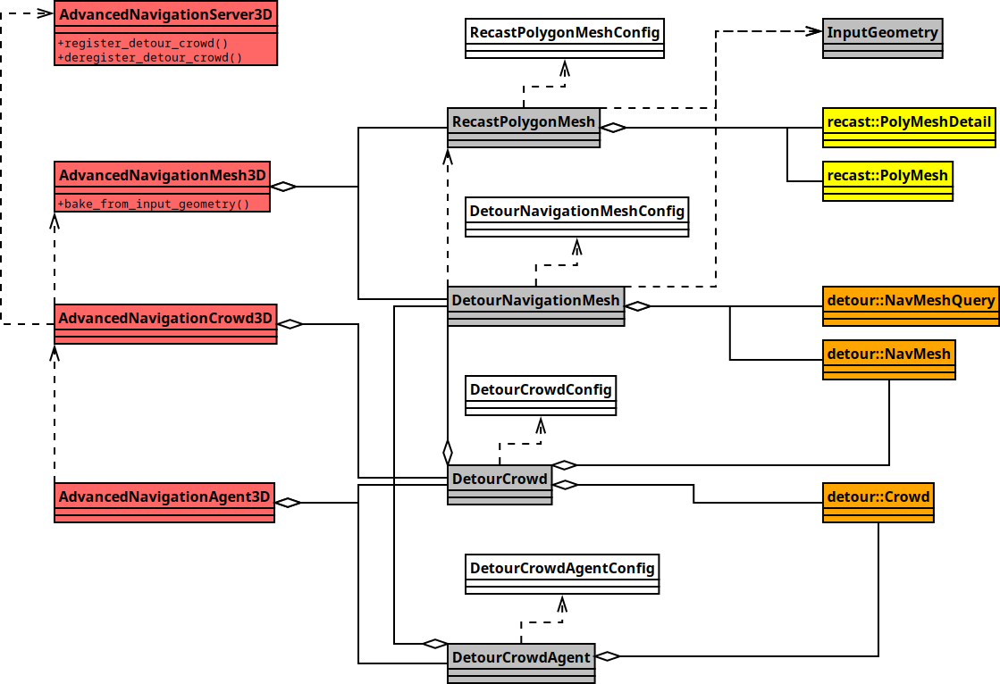

# Advanced Navigation Plugin for Godot

Work in progress, not entirely stable right now.

# Documentation

## Nodes

### AdvancedNavigationServer3D
#### methods
 - `register_detour_crowd`
 - `deregister_detour_crowd`
 - `create_empty_input_geometry`
 - `get_empty_input_geometry`
 - `create_empty_recast_polygon_mesh_config`
 - `create_empty_detour_navigation_mesh_config`
 - `create_empty_detour_navigation_mesh`
 - `create_empty_detour_crowd_config`
 - `create_empty_detour_crowd`
 - `create_empty_detour_crowd_agent_config`

### AdvancedNavigationMesh3D
#### properties
 - `get_closest_point`
 - `get_simple_path`
#### methods
 - `bake`
 - `bake_from_input_geometry`
 - `clear`
 - `get_closest_point`
 - `get_simple_path`
#### signals
 - `baked`

### AdvancedNavigationCrowd3D
#### properties
 - `backend`
 - `parameters`
#### methods
 - `set_navigation_mesh`
#### signals
 - `changed`

### AdvancedNavigationAgent3D
#### properties
 - `position`
 - `target`
 - `passive_movement`
 - `target_desired_distance`
 - `backend`
 - `parameters`
#### methods
 - `set_navigation_crowd`
 - `set_position`
 - `set_target`
 - `get_position`
 - `get_target`
#### signals
 - `new_position`
 - `new_velocity`

## Resources

### InputGeometry
#### methods
 - `add_nodes`
 - `add_resources`
 - `add_resources_with_transforms`

### RecastPolygonMeshConfig
### RecastPolygonMesh
### DetourNavigationMeshConfig
### DetourNavigationMesh
#### methods
 - `build_from_input_geometry`
 - `create_crowd`
 - `get_closest_point`
 - `get_closest_point_with_extents`
 - `get_simple_path`
 - `get_simple_path_with_extents`

### DetourCrowdConfig

### DetourCrowd
#### methods
 - `initialize`
 - `create_agent`
 - `update`
#### signals
 - `updated`

### DetourCrowdAgentConfig

### DetourCrowdAgent
#### properties
 - `position`
 - `velocity`
 - `state`
#### methods
 - `set_target`
 - `set_target_with_extents`
 - `get_target`
#### signals
 - `new_position`
 - `new_velocity`

# Design

## 3D overview

